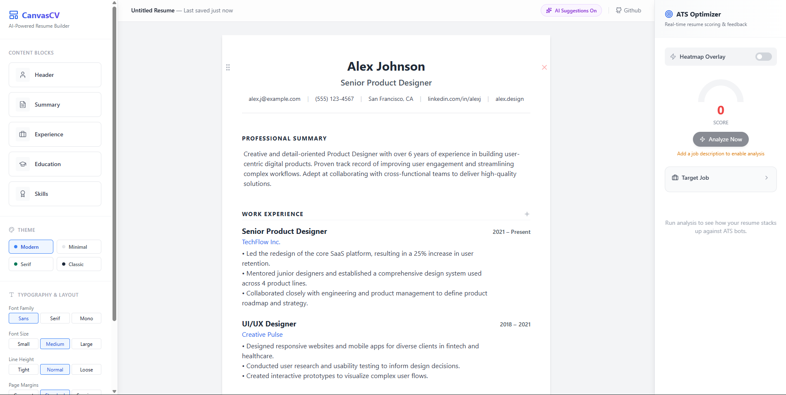

# CanvasCV - AI-Powered Resume Builder

An AI-powered, block-based resume editor featuring drag-and-drop layout, inline editing, and intelligent text optimization.

## ✨ Features

### 🎨 **Block-Based Editor**
- **Modular Content Blocks**: Add, remove, and reorder resume sections (Header, Summary, Experience, Education, Skills) with ease
- **Drag-and-Drop Interface**: Intuitively rearrange blocks to customize your resume layout
- **Inline Editing**: Click anywhere to edit content directly on the page - no separate forms or popups

### 🤖 **AI-Powered Features**
- **Smart Text Optimization**: Enhance any section with AI-powered rewriting, grammar fixes, and professional tone adjustments
- **Auto-Completion**: Get intelligent suggestions as you type experience descriptions
- **AI Suggestions Toggle**: Enable or disable AI assistance based on your preference
- **Custom AI Instructions**: Provide specific instructions for how you want your text improved

### 🎯 **ATS Optimizer**
- **Real-Time Scoring**: Get instant ATS compatibility scores (0-100) with visual feedback
- **Job Description Matching**: Paste a job description to get tailored keyword recommendations
- **Keyword Heatmap**: Visual overlay highlighting missing keywords, metrics, and action verbs
- **Critical Issue Detection**: Identify and fix problems that could cause ATS rejection
- **Missing Keywords**: See exactly which keywords from the job description are missing from your resume
- **Positive Feedback**: Get recognition for what you're doing well

### 🎨 **Customization Options**
- **Multiple Themes**: Choose from Modern, Minimal, Serif, or Classic themes
- **Typography Control**: Customize font family (Sans, Serif, Mono), size, and line height
- **Page Layout**: Adjust page margins (Compact, Standard, Spacious) for optimal formatting
- **Visual Styling**: Each theme comes with carefully crafted color schemes and typography

### 📄 **Export & Share**
- **PDF Export**: Download your resume as a print-ready PDF
- **Public Link Sharing**: Generate shareable links for your resume
- **Print-Optimized**: Clean, professional output ready for applications

### 💡 **Smart Features**
- **Content Highlighting**: Visual indicators for metrics, action verbs, and important keywords
- **Context-Aware AI**: AI suggestions adapt based on the section you're editing
- **Real-Time Updates**: See changes instantly as you edit
- **Professional Templates**: Pre-styled layouts that work for any industry

## Run Locally

**Prerequisites:**  Node.js

1. Install dependencies:
   `npm install`
2. Set the `GEMINI_API_KEY` in [.env.local](.env.local) to your Canvas AI API key
3. Run the app:
   `npm run dev`
